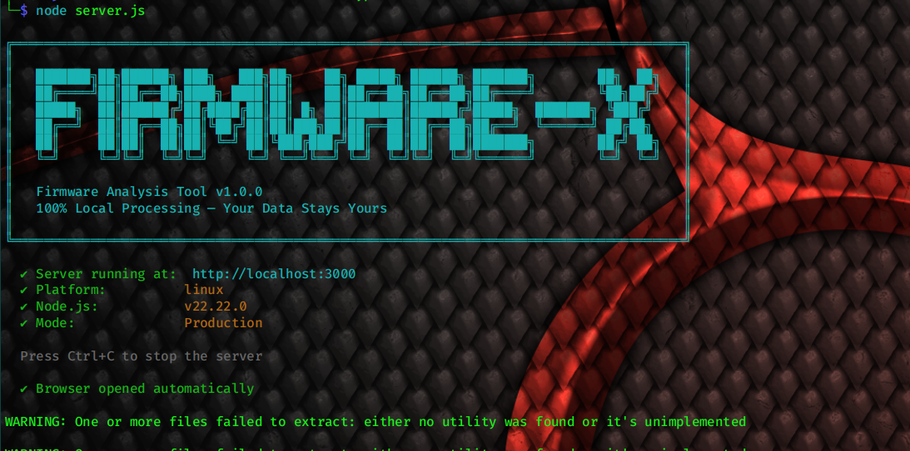
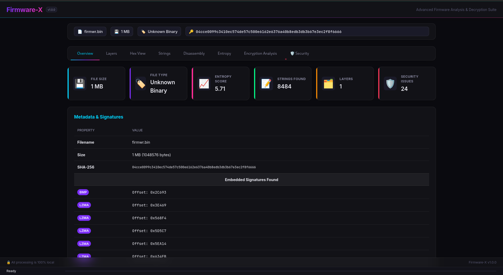
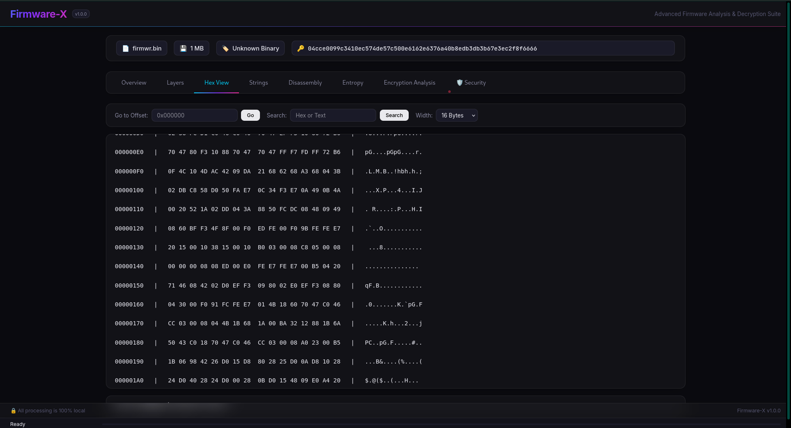
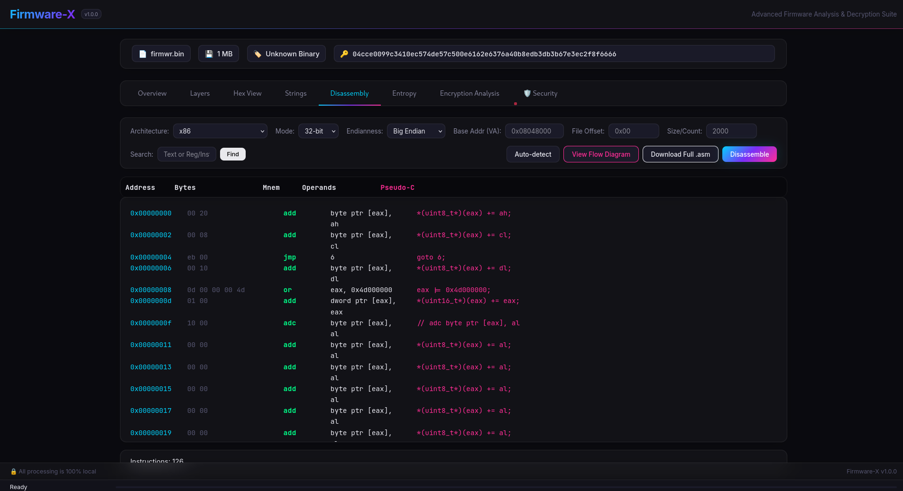
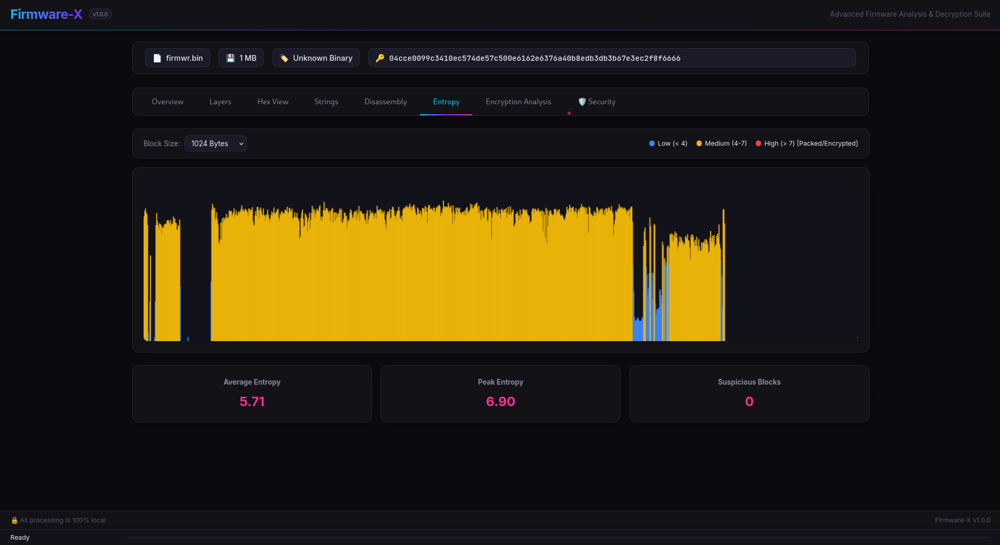
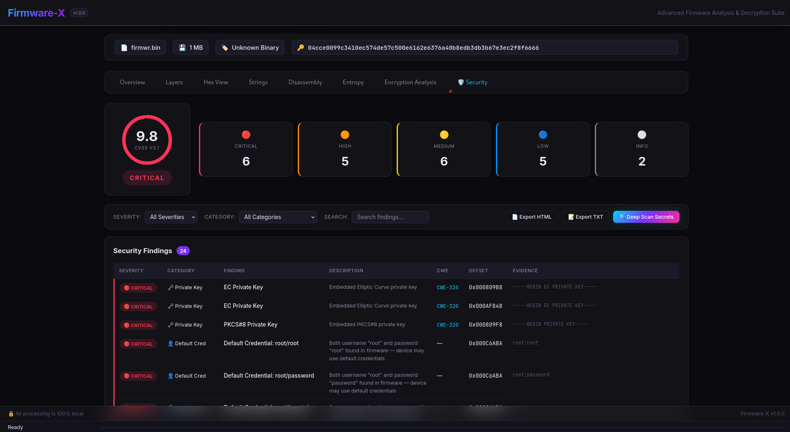
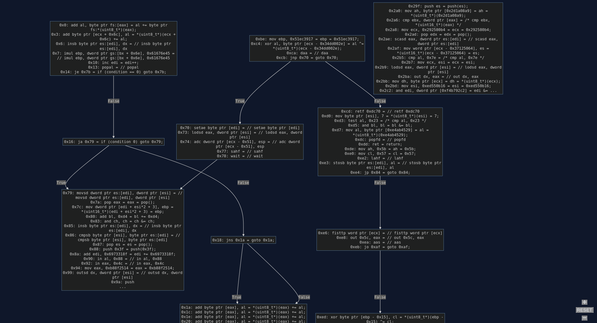

# 🔬 Firmware-X — Firmware Analysis Tool

```
```









A **cross-platform** (Windows + Linux + macOS), layer-by-layer firmware analysis tool that can **decrypt**, **decompress**, **parse**, and **disassemble** firmware files of any format.

> 🔒 **100% Local Processing** — All analysis runs entirely on your machine. No data is ever uploaded to any server.

---

## ✨ Features

| Feature | Description |
|:---|:---|
| 🔍 **Magic Byte Detection** | Auto-detect 40+ file formats via signature scanning |
| 📦 **Layer-by-Layer Extraction** | Recursively unwrap nested archives, compressed data, and embedded binaries |
| 📁 **Multi-Format Support** | .bin, .exe, .elf, .hex, .srec, .uf2, .dfu, .zip, .gz, .tar, .7z, .img, .apk, and more |
| 📊 **Entropy Analysis** | Visual entropy graph to identify encrypted/compressed/padding regions |
| 📝 **String Extraction** | Find readable ASCII/UTF-8/UTF-16 strings with pattern classification |
| 🔢 **Hex Viewer** | Interactive hex dump with offset navigation, search, and highlighting |
| ⚙️ **Multi-Arch Disassembly** | x86, ARM, ARM64, MIPS, PowerPC, SPARC, M68K, RISC-V, and more via Capstone.js |
| 📋 **ELF/PE Parser** | Parse executable headers, sections, symbols, and metadata |
| 🔄 **Format Conversion** | Decode Intel HEX, Motorola SREC, UF2, DFU to raw binary |
| 🔐 **Decryption** | AES, XOR, RC4, ROT13/Caesar with brute-force capabilities |
| 🛡️ **Deep Security Scanner** | Backend regex engine streams binary to detect AWS keys, RSA/EC certificates, JWT tokens, `/etc/shadow` root passwords, and GitHub PATs. |
| 🌊 **8GB+ File Streaming** | Zero-RAM Web UI implementation streams massive firmware files directly from disk to network without crashing the browser. |
| 🖥️ **Dual Interface** | Premium Web UI + full-featured cross-platform CLI tool (`--wsl` support) |
| 🌐 **Cross-Platform** | Windows (Native or WSL), Ubuntu, Kali Linux, Debian, macOS |

---

## 🏗️ Supported Architectures

| Architecture | Detection | Disassembly | Description |
|:---|:---:|:---:|:---|
| **x86** | ✅ | ✅ 16/32/64-bit | Intel/AMD x86 family |
| **ARM** | ✅ | ✅ ARM/Thumb | ARM 32-bit |
| **ARM64 / AArch64** | ✅ | ✅ | ARM 64-bit |
| **MIPS** | ✅ | ✅ MIPS32/64/Micro | MIPS family |
| **PowerPC** | ✅ | ✅ 32/64-bit | IBM PowerPC |
| **SPARC** | ✅ | ✅ V8/V9 | Oracle SPARC |
| **SystemZ (s390x)** | ✅ | ✅ | IBM System/390 |
| **M68K** | ✅ | ✅ 68000-68060 | Motorola 68000 series |
| **RISC-V** | ✅ | 🔄 | RISC-V 32/64-bit |
| **Xtensa** | ✅ | ❌ | ESP32/ESP8266 |
| **AVR** | ✅ | ❌ | Arduino/ATmega |
| **SuperH** | ✅ | ❌ | Renesas SH |
| **MSP430** | ✅ | ❌ | TI MSP430 |
| **XCore** | ✅ | ✅ | XMOS XCore |
| **TMS320C6x** | ✅ | ✅ | TI C6000 DSP |

---

## 📁 Supported File Formats

| Format | Extension | Magic Bytes | Detection | Extraction |
|:---|:---|:---|:---:|:---:|
| ELF | .elf, .so, .o | `7F 45 4C 46` | ✅ | ✅ |
| PE/EXE | .exe, .dll, .sys | `4D 5A` | ✅ | ✅ |
| ZIP | .zip, .apk, .jar | `50 4B 03 04` | ✅ | ✅ |
| GZIP | .gz, .tgz | `1F 8B` | ✅ | ✅ |
| TAR | .tar | `ustar` @ 257 | ✅ | ✅ |
| 7-Zip | .7z | `37 7A BC AF 27 1C` | ✅ | ⚠️ |
| RAR | .rar | `52 61 72 21` | ✅ | ⚠️ |
| BZIP2 | .bz2 | `42 5A 68` | ✅ | ⚠️ |
| XZ | .xz | `FD 37 7A 58 5A 00` | ✅ | ⚠️ |
| LZMA | .lzma | `5D 00 00` | ✅ | ⚠️ |
| Intel HEX | .hex, .ihex | `:` (text) | ✅ | ✅ |
| Motorola SREC | .srec, .s19, .s28 | `S0`/`S1` (text) | ✅ | ✅ |
| UF2 | .uf2 | `55 46 32 0A` | ✅ | ✅ |
| DFU | .dfu | `UFD` suffix | ✅ | ✅ |
| SquashFS | .sqfs | `hsqs`/`sqsh` | ✅ | ⚠️ |
| CramFS | - | `45 3D CD 28` | ✅ | ⚠️ |
| JFFS2 | - | `85 19` | ✅ | ⚠️ |
| U-Boot Image | - | `27 05 19 56` | ✅ | ✅ |
| Android Boot | .img | `ANDROID!` | ✅ | ✅ |
| FIT Image | .itb | `D0 0D FE ED` | ✅ | ✅ |
| Mach-O | - | `FE ED FA CE/CF` | ✅ | ✅ |
| PDF | .pdf | `%PDF` | ✅ | — |
| PNG | .png | `89 50 4E 47` | ✅ | — |
| JPEG | .jpg, .jpeg | `FF D8 FF` | ✅ | — |

✅ = Full support | ⚠️ = Detection only / partial | — = Not applicable

---

## 🚀 Quick Start

### Installation

#### Windows (Command Prompt)
```batch
cd "Firmware Decryption"
install.bat
```

#### Windows (PowerShell)
```powershell
cd "Firmware Decryption"
.\install.ps1
```

#### Ubuntu / Kali Linux
```bash
cd "Firmware Decryption"
chmod +x install.sh
./install.sh
```

#### Ubuntu / Kali Linux (Full — with binwalk, radare2)
```bash
./install.sh --full
```

### Usage

#### Web UI
```bash
npm start
# Opens http://localhost:3000 in your browser automatically
```

#### CLI
```bash
node cli.js --help
```

---

## 💻 CLI Reference

### `detect` — File Type Detection
```bash
node cli.js detect firmware.bin              # Detect primary file type
node cli.js detect firmware.bin --scan       # Scan for all embedded signatures
node cli.js detect firmware.bin --json       # Output as JSON
```

### `analyze` — Full Layer-by-Layer Analysis
```bash
node cli.js analyze firmware.bin                          # Full analysis
node cli.js analyze firmware.bin --depth 5                # Limit recursion depth
node cli.js analyze firmware.bin --output ./results       # Save extracted layers
node cli.js analyze firmware.bin --json                   # JSON output
```

### `entropy` — Entropy Analysis
```bash
node cli.js entropy firmware.bin                          # Entropy with ASCII graph
node cli.js entropy firmware.bin --block-size 512         # Custom block size
node cli.js entropy firmware.bin --width 80               # Wider graph
```

### `strings` — String Extraction
```bash
node cli.js strings firmware.bin                          # Extract all strings
node cli.js strings firmware.bin --min-length 8           # Min 8 chars
node cli.js strings firmware.bin --type url               # URLs only
node cli.js strings firmware.bin --type credential        # Credential patterns
node cli.js strings firmware.bin --encoding utf16         # UTF-16 strings
```

### `hexdump` — Hex Dump
```bash
node cli.js hexdump firmware.bin                          # First 256 bytes
node cli.js hexdump firmware.bin --offset 0x1000          # Start at offset
node cli.js hexdump firmware.bin --length 512             # Show 512 bytes
node cli.js hexdump firmware.bin --width 32               # 32 bytes per row
```

### `decrypt` — Decryption
```bash
# XOR decryption
node cli.js decrypt firmware.enc --method xor --key "FF"
node cli.js decrypt firmware.enc --method xor --key "AB CD EF" --key-format hex

# XOR brute-force (try all 256 single-byte keys)
node cli.js decrypt firmware.enc --method xor --brute-force

# AES decryption
node cli.js decrypt firmware.enc --method aes --key "0123456789ABCDEF" --key-format hex --mode cbc --iv "00000000000000000000000000000000"

# RC4 decryption
node cli.js decrypt firmware.enc --method rc4 --key "mykey" --key-format ascii

# ROT13 / Caesar
node cli.js decrypt message.txt --method rot
node cli.js decrypt message.txt --method caesar  # Brute-force all shifts

# Save decrypted output
node cli.js decrypt firmware.enc --method xor --key "FF" --output decrypted.bin
```

### `disasm` — Disassembly
```bash
# Auto-detect architecture from ELF/PE headers
node cli.js disasm firmware.elf --auto

# Manual architecture selection
node cli.js disasm firmware.bin --arch x86 --mode 64
node cli.js disasm firmware.bin --arch arm --mode thumb --endian little
node cli.js disasm firmware.bin --arch mips --mode mips32 --endian big
node cli.js disasm firmware.bin --arch ppc --mode 32 --endian big
node cli.js disasm firmware.bin --arch m68k --mode 32
node cli.js disasm firmware.bin --arch sparc --mode v9

# Options
node cli.js disasm firmware.bin --arch x86 --mode 32 --offset 0x1000 --length 512
node cli.js disasm firmware.bin --arch arm --mode arm --base-address 0x8000
node cli.js disasm firmware.bin --arch x86 --mode 64 --max-instructions 50
```

### `extract` — Layer Extraction
```bash
node cli.js extract firmware.zip --output ./extracted     # Extract all layers
node cli.js extract firmware.bin --depth 3                # Limit depth
node cli.js extract firmware.bin --backend binwalk        # Force native binwalk backend (instead of pure JS)
node cli.js extract firmware.bin --backend binwalk --wsl  # (Windows) Route binwalk through WSL
```

### `info` — Binary Header Info
```bash
node cli.js info firmware.elf                   # ELF header summary
node cli.js info firmware.elf --sections        # Include section details
node cli.js info firmware.exe --headers         # All headers
node cli.js info firmware.elf --json            # JSON output
```

### `convert` — Format Conversion
```bash
node cli.js convert firmware.hex                         # Intel HEX → raw binary
node cli.js convert firmware.srec                        # S-Record → raw binary
node cli.js convert firmware.uf2                         # UF2 → raw binary
node cli.js convert firmware.dfu                         # DFU → raw binary
node cli.js convert firmware.hex --output output.bin     # Custom output name
node cli.js convert firmware.hex --format ihex           # Force format
```

### `security` — Security & Vulnerability Scanning
```bash
# Full security scan
node cli.js security firmware.bin

# Filter by severity
node cli.js security firmware.bin --severity critical     # Critical only
node cli.js security firmware.bin --severity high         # High + Critical

# Filter by category
node cli.js security firmware.bin --category credential   # Credentials only
node cli.js security firmware.bin --category private_key  # Private keys only
node cli.js security firmware.bin --category backdoor     # Backdoors only
node cli.js security firmware.bin --category weak_crypto  # Weak crypto only
node cli.js security firmware.bin --category api_key      # API keys only

# Selective scanning
node cli.js security firmware.bin --no-defaults           # Skip default cred check
node cli.js security firmware.bin --no-vulns              # Skip vulnerable function scan
node cli.js security firmware.bin --no-network            # Skip network pattern scan

# Export report
node cli.js security firmware.bin --output report.txt     # Save to file
node cli.js security firmware.bin --json                  # JSON output
node cli.js security firmware.bin --json > report.json    # Pipe JSON to file
```

**What it scans for:**
| Category | Examples |
|:---|:---|
| 🔑 Credentials | Hardcoded passwords, password hashes (MD5/SHA/bcrypt), unix passwd entries |
| 🗝️ Private Keys | RSA, EC, DSA, SSH, PGP private keys, PKCS#8, X.509 certificates |
| 🔐 API Keys | AWS, Google, GitHub, Slack, Stripe, OpenAI, Square, JWT tokens |
| ⚠️ Unsafe Functions | `strcpy`, `gets`, `sprintf`, `system`, `popen` (with CWE IDs) |
| 🚪 Backdoors | Reverse shells, debug shells, netcat listeners, master passwords |
| 🔓 Weak Crypto | DES, RC4, MD5, SHA-1, disabled TLS verification, SSLv2/v3 |
| 🌐 Insecure Protocols | HTTP, FTP, Telnet URLs with embedded credentials |
| 👤 Default Credentials | admin/admin, root/root, ubnt/ubnt, pi/raspberry, and 20+ more |
| 📁 Sensitive Paths | /etc/shadow, SSH keys, .env files, WordPress configs |
| 📡 Hardcoded IPs | IP addresses, MAC addresses (potential C2 endpoints) |

---

## 🌐 Web UI

The Web UI provides a premium, interactive analysis experience with:

- **Drag & Drop** file upload with animated drop zone
- **Tab-based** interface: Overview, Layers, Hex View, Strings, Disassembly, Entropy, Decryption, **Security**
- **Dark theme** with glassmorphism, gradient accents, and smooth animations
- **Interactive entropy chart** with color-coded regions
- **Virtual-scrolling hex viewer** for large files
- **Layer tree** with collapsible nodes and type-colored badges
- **Multi-architecture disassembly** with auto-detection
- **Decryption panel** with XOR brute-force, AES, RC4, and more
- **Security dashboard** with risk score gauge, severity breakdown, filterable findings table, and exportable reports

Start the Web UI:
```bash
npm start
```

---

## 🏗️ Architecture

```
firmwarex/
├── public/                    # Web UI files
│   ├── index.html             # Main HTML page
│   ├── style.css              # Premium dark theme CSS
│   ├── app.js                 # UI controller
│   └── lib/                   # Client-side libraries
│       ├── fflate.min.js      # Compression (auto-copied)
│       └── jszip.min.js       # ZIP handling (auto-copied)
├── modules/                   # Analysis modules (shared browser + Node.js)
│   ├── file-detector.js       # Magic byte signature detection (40+ formats)
│   ├── layer-engine.js        # Recursive layer extraction engine
│   ├── archive-extractor.js   # ZIP/GZIP/TAR/ZLIB decompression
│   ├── binary-parser.js       # ELF & PE format parsers
│   ├── hex-decoder.js         # Intel HEX / SREC / UF2 / DFU decoders
│   ├── entropy-analyzer.js    # Shannon entropy analysis
│   ├── string-extractor.js    # String extraction with pattern matching
│   ├── hex-viewer.js          # Hex dump viewer (web + CLI)
│   ├── disassembler.js        # Capstone.js multi-arch disassembly
│   ├── decryption-engine.js   # XOR/AES/RC4/ROT decryption
│   └── security-analyzer.js   # Secrets, vulnerabilities & backdoor detection
├── server.js                  # Express.js local web server
├── cli.js                     # CLI tool (commander + chalk)
├── package.json               # Node.js project config
├── install.bat                # Windows installer (batch)
├── install.ps1                # Windows installer (PowerShell)
├── install.sh                 # Linux installer (bash)
└── README.md                  # This file
```

All analysis modules use a **UMD (Universal Module Definition)** pattern that works in both browser (`<script>` tags) and Node.js (`require()`).

---

## 🔧 Prerequisites

### Windows
| Requirement | Version | Required? |
|:---|:---|:---|
| Node.js | ≥ 18.0 | ✅ Required |
| npm | ≥ 9.0 | ✅ (bundled with Node.js) |
| Web Browser | Chrome/Edge/Firefox | ✅ For Web UI |
| binwalk & unsquashfs | Any | ❌ Optional (Required for CLI Extraction) |

### Linux (Ubuntu/Kali)
| Requirement | Version | Required? |
|:---|:---|:---|
| Node.js | ≥ 18.0 | ✅ Required |
| npm | ≥ 9.0 | ✅ (bundled with Node.js) |
| binutils | Any | ❌ Optional (strings, readelf, objdump) |
| binwalk & unsquashfs | Any | ❌ Optional (Required for CLI Extraction) |
| radare2 | Any | ❌ Optional (--full install) |

---

## 🐛 Troubleshooting

### Windows

**`'node' is not recognized`**
- Install Node.js from https://nodejs.org/ or run `winget install OpenJS.NodeJS.LTS`
- Restart your terminal after installation

**`npm install fails`**
- Run as Administrator
- Try: `npm install --verbose` to see detailed errors
- Clear cache: `npm cache clean --force`

**PowerShell execution policy error**
```powershell
Set-ExecutionPolicy -ExecutionPolicy RemoteSigned -Scope CurrentUser
```

**`binwalk` is not recognized**
- `binwalk` and `unsquashfs` are native Linux tools. We have implemented several mitigations:
  - **Option 1 (Pure JS Bypass):** The Node.js server and CLI now feature a "Pure JS Magic Byte Scanner" which will automatically bypass broken `binwalk` installations, find the `hsqs` squashfs offsets in pure javascript, and attempt to run `unsquashfs` directly.
  - **Option 2 (CLI --wsl flag):** If you are running `cli.js` on Windows, pass the `--wsl` flag to automatically route execution through the Windows Subsystem for Linux (e.g. `node cli.js extract --backend binwalk --wsl`).
  - **Option 3 (WSL Native):** Run the entire Node.js server natively inside a WSL Ubuntu terminal.

### Linux

**`Permission denied: ./install.sh`**
```bash
chmod +x install.sh
```

**`Node.js version too old`**
```bash
# Use nvm to install latest
curl -o- https://raw.githubusercontent.com/nvm-sh/nvm/v0.39.7/install.sh | bash
source ~/.bashrc
nvm install 20
```

**`EACCES permission error on npm install`**
```bash
# Fix npm permissions
mkdir -p ~/.npm-global
npm config set prefix '~/.npm-global'
echo 'export PATH=~/.npm-global/bin:$PATH' >> ~/.bashrc
source ~/.bashrc
```

---

## 📄 License

MIT License — See [LICENSE](LICENSE) for details.

---

## 🙏 Acknowledgments

- [Capstone.js](https://github.com/nickcano/capstone.js) — Multi-architecture disassembly engine
- [fflate](https://github.com/101arrowz/fflate) — Fast compression library
- [JSZip](https://stuk.github.io/jszip/) — ZIP file handling
- [Commander.js](https://github.com/tj/commander.js) — CLI framework
- [Chalk](https://github.com/chalk/chalk) — Terminal string styling
